# Nirmana-Shell

PowerShell 7 terminal environment for Windows. Configures Starship prompt, PSReadLine predictive completion, Zoxide directory navigation, Eza file listing, FZF history search, Delta git diffs, FD, and Ripgrep.

---

## Quick Start

Open PowerShell as Administrator, then run:

### Remote Install

```powershell
irm https://raw.githubusercontent.com/Andndre/nirmana-shell/main/setup.ps1 | iex
```

### Local Install

```powershell
git clone https://github.com/Andndre/nirmana-shell.git
cd nirmana-shell
.\setup.ps1
```

The script performs the following tasks:

1. Installs required tools via WinGet (`pwsh`, `git`, `starship`, `zoxide`, `eza`, `fzf`, `delta`, `fd`, `rg`, and Cascadia Code Nerd Font).
2. Configures Git to use `delta` as the default pager.
3. Sets up `~/.nirmana-shell` and installs the PowerShell 7 profile (preserving pre-existing profiles in `.orig`).
4. Sets the default Starship configuration.
5. Disables the console bell on backspace.
6. Sets PowerShell 7 as the default profile in Windows Terminal with synchronized color schemes.

---

## Font Configuration: Nerd Font

Icons used by Starship and Eza require a patched Nerd Font. `setup.ps1` automatically installs Cascadia Code Nerd Font via WinGet.

If configuring manually or verifying:

1. Ensure Cascadia Code Nerd Font is installed (or run `nirmana doctor --fix`).
2. In Windows Terminal: Go to **Settings (Ctrl + ,)** > **Defaults** > **Appearance** > **Font face** > Select **`CaskaydiaCove NF`**.

---

## Shortcuts and Commands

| Feature             | Shortcut / Command     | Description                                                           |
| :------------------ | :--------------------- | :-------------------------------------------------------------------- |
| Inline Autocomplete | Gray text              | History-based prediction                                              |
| Accept Suggestion   | `Right Arrow` / `End`  | Accept full prediction                                                |
| Accept Word         | `Ctrl + F`             | Accept next word of prediction                                        |
| Toggle View         | `F2`                   | Switch between inline and list prediction (persisted across sessions) |
| History Search      | `Ctrl + R`             | Fullscreen fuzzy history search using `fzf`                           |
| Menu Completion     | `Tab`                  | Interactive completion menu                                           |
| Directory Jump      | `z <folder>`           | Jump to previously visited directory                                  |
| Interactive Jump    | `zi`                   | Select directory interactively via `fzf`                              |
| Add Directory       | `za [folder]`          | Add directory to zoxide (default: current folder)                     |
| File Listing        | `ls`, `ll`, `la`, `lt` | Directory listing using `eza`                                         |
| Git Diffs           | `git diff`, `git show` | Syntax-highlighted diffs using `delta`                                |
| File Search         | `fd <query>`           | Fast file search                                                      |
| Text Search         | `rg <query>`           | Fast recursive regex text search                                      |

> [!TIP]
> **User Custom Extensions:** Place personal functions, tokens, and aliases in `~/.config/nirmana/custom.ps1`. This file is loaded automatically by your profile and is **never overwritten** during Nirmana-Shell updates.
> **Persistent Preferences:** Theme choice and F2 prediction view style are saved in `~/.config/nirmana/settings.json` and survive all updates.

---

## CLI Helper: `nirmana-shell`

The `nirmana-shell` command (alias: `nirmana`) is registered globally:

| Command                                  | Description                                                                 |
| :--------------------------------------- | :-------------------------------------------------------------------------- |
| `nirmana theme`                          | Open interactive theme switcher with top prompt preview and rounded borders |
| `nirmana theme <name>`                   | Apply a specific theme (supports Tab completion)                            |
| `nirmana import-theme <url/file> [name]` | Import & transpile Oh My Posh theme JSON to Starship TOML                   |
| `nirmana version`                        | Display installed version, commit hash, and PowerShell environment          |
| `nirmana doctor`                         | Verify PATH and health of all CLI tools and Nerd Font status                |
| `nirmana doctor --fix`                   | Automatically install missing CLI dependencies and fonts via WinGet         |
| `nirmana benchmark`                      | Profile sub-second startup latency across profile components                |
| `nirmana update`                         | Pull latest updates from GitHub                                             |
| `nirmana reload`                         | Reload the active PowerShell profile                                        |
| `nirmana uninstall`                      | Interactively remove Nirmana and restore original profile backup            |

### Available Themes and Presets

Supports 17 curated custom themes, 109 ported Oh My Posh community themes, and 10 official Starship presets (total: 136 themes). All themes are fully integrated with the interactive FZF switcher (`nirmana theme`).

<details open>
<summary><b>Custom Themes Gallery (18 Curated Themes)</b></summary>

| Theme                                                     | Preview                                                             | Command                               |
| :-------------------------------------------------------- | :------------------------------------------------------------------ | :------------------------------------ |
| **nirmana**<br>_Signature cyan & purple_                  | 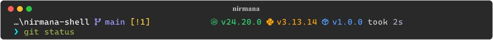                             | `nirmana theme nirmana`               |
| **catppuccin-mocha**<br>_Pastel aesthetic_                | 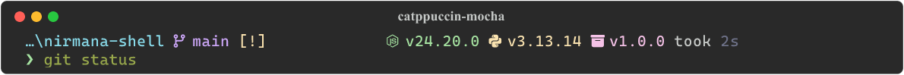           | `nirmana theme catppuccin-mocha`      |
| **takuya**<br>_Craftzdog capsule & clock_                 |                                | `nirmana theme takuya`                |
| **tokyo-night**<br>_Cyberpunk dark palette_               | 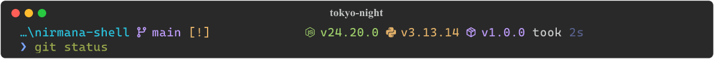                     | `nirmana theme tokyo-night`           |
| **bubbles**<br>_Indigo capsules & vibrant accents_        | 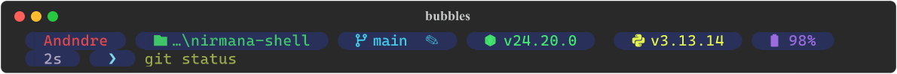                             | `nirmana theme bubbles`               |
| **powerlevel10k_rainbow**<br>_Multi-color rainbow ribbon_ | 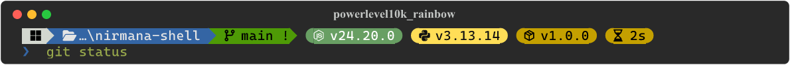 | `nirmana theme powerlevel10k_rainbow` |
| **minimal-emerald**<br>_Emerald green minimalist_         | 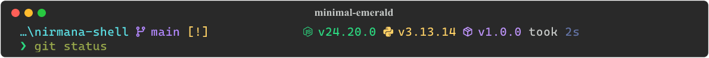             | `nirmana theme minimal-emerald`       |
| **clean-detailed**<br>_Right-aligned runtime & duration_  | 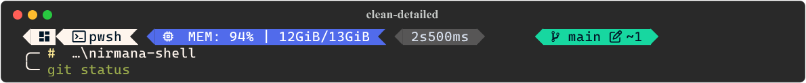               | `nirmana theme clean-detailed`        |
| **dracula**<br>_Official Dracula palette_                 | 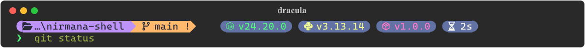                             | `nirmana theme dracula`               |
| **spaceship**<br>_Cosmic developer prompt_                | 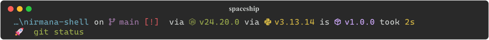                         | `nirmana theme spaceship`             |
| **atomic**<br>_Warm orange & yellow pills_                | 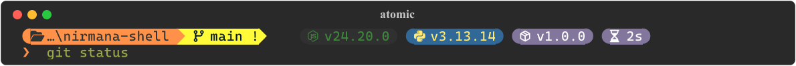                               | `nirmana theme atomic`                |
| **half-life**<br>_Electric green & orange lambda_         |                          | `nirmana theme half-life`             |
| **paradox**<br>_Sky blue chevron segments_                |                              | `nirmana theme paradox`               |
| **jandedobbeleer**<br>_Pink & yellow chevron prompt_      |                | `nirmana theme jandedobbeleer`        |
| **agnoster**<br>_Classic powerline ribbon_                |                            | `nirmana theme agnoster`              |
| **jetpack**<br>_Futuristic geometric single-line_         | 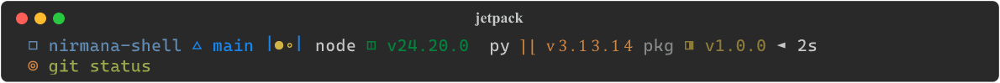                             | `nirmana theme jetpack`               |
| **robbyrussell**<br>_Legendary minimal arrow prompt_      |                    | `nirmana theme robbyrussell`          |
| **1_shell**<br>_Pastel system info prompt (OMP)_          |                              | `nirmana theme 1_shell`               |

</details>

<details>
<summary><b>Ported Oh My Posh Themes (109 Themes - Click to Expand)</b></summary>

| Theme | Preview | Command |
| :---- | :------ | :------ |
| **agnoster.minimal** |  | `nirmana theme agnoster.minimal` |
| **agnosterplus** | 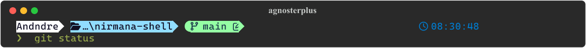 | `nirmana theme agnosterplus` |
| **aliens** |  | `nirmana theme aliens` |
| **amro** |  | `nirmana theme amro` |
| **atomicBit** | 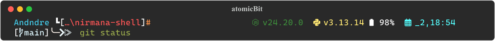 | `nirmana theme atomicBit` |
| **avit** | 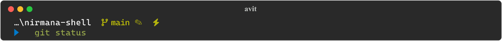 | `nirmana theme avit` |
| **blue-owl** | 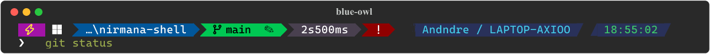 | `nirmana theme blue-owl` |
| **blueish** |  | `nirmana theme blueish` |
| **bubblesextra** | 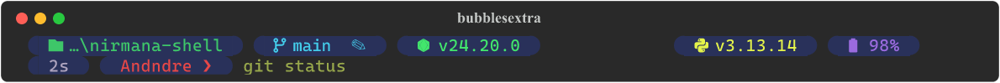 | `nirmana theme bubblesextra` |
| **bubblesline** | 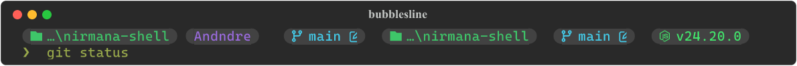 | `nirmana theme bubblesline` |
| **capr4n** | 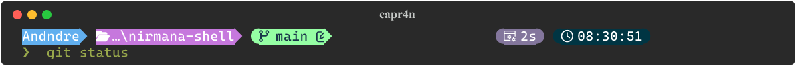 | `nirmana theme capr4n` |
| **catppuccin** |  | `nirmana theme catppuccin` |
| **catppuccin_frappe** | 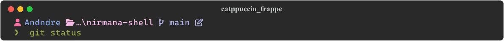 | `nirmana theme catppuccin_frappe` |
| **catppuccin_latte** |  | `nirmana theme catppuccin_latte` |
| **catppuccin_macchiato** |  | `nirmana theme catppuccin_macchiato` |
| **cert** | 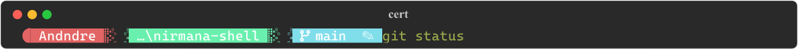 | `nirmana theme cert` |
| **chips** | 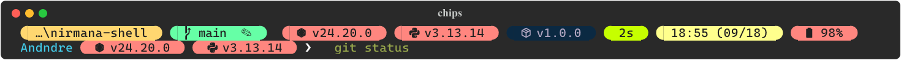 | `nirmana theme chips` |
| **cinnamon** |  | `nirmana theme cinnamon` |
| **cloud-context** |  | `nirmana theme cloud-context` |
| **cloud-native-azure** | 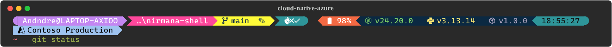 | `nirmana theme cloud-native-azure` |
| **cobalt2** |  | `nirmana theme cobalt2` |
| **craver** | 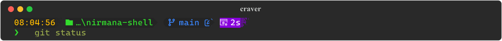 | `nirmana theme craver` |
| **darkblood** |  | `nirmana theme darkblood` |
| **di4am0nd** |  | `nirmana theme di4am0nd` |
| **easy-term** |  | `nirmana theme easy-term` |
| **emodipt** | 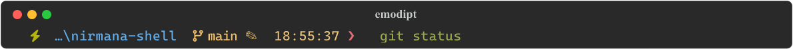 | `nirmana theme emodipt` |
| **emodipt-extend** | 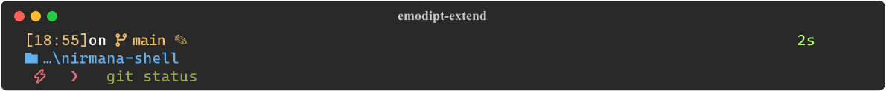 | `nirmana theme emodipt-extend` |
| **fish** |  | `nirmana theme fish` |
| **free-ukraine** |  | `nirmana theme free-ukraine` |
| **froczh** | 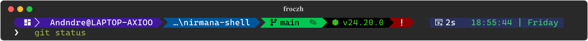 | `nirmana theme froczh` |
| **gmay** |  | `nirmana theme gmay` |
| **grandpa-style** | 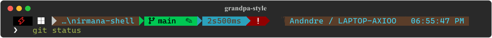 | `nirmana theme grandpa-style` |
| **gruvbox** |  | `nirmana theme gruvbox` |
| **honukai** |  | `nirmana theme honukai` |
| **hotstick.minimal** | 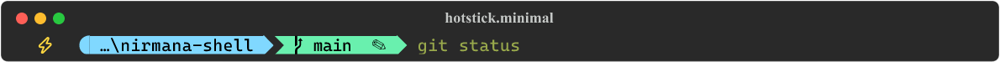 | `nirmana theme hotstick.minimal` |
| **hul10** | 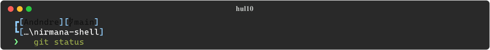 | `nirmana theme hul10` |
| **hunk** | 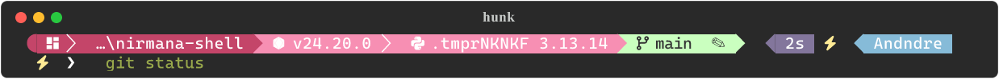 | `nirmana theme hunk` |
| **huvix** | 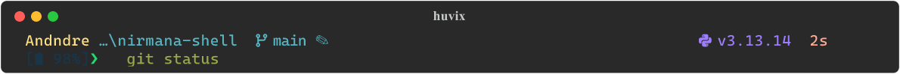 | `nirmana theme huvix` |
| **if_tea** | 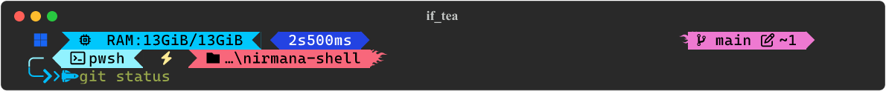 | `nirmana theme if_tea` |
| **illusi0n** |  | `nirmana theme illusi0n` |
| **iterm2** |  | `nirmana theme iterm2` |
| **jandedobbeleer-accessible** |  | `nirmana theme jandedobbeleer-accessible` |
| **jblab_2021** |  | `nirmana theme jblab_2021` |
| **jonnychipz** | 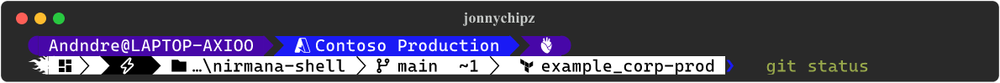 | `nirmana theme jonnychipz` |
| **json** | 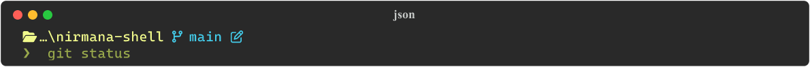 | `nirmana theme json` |
| **jtracey93** |  | `nirmana theme jtracey93` |
| **jv_sitecorian** |  | `nirmana theme jv_sitecorian` |
| **kali** |  | `nirmana theme kali` |
| **kushal** | 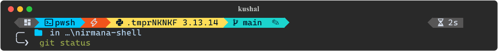 | `nirmana theme kushal` |
| **lambda** |  | `nirmana theme lambda` |
| **lambdageneration** |  | `nirmana theme lambdageneration` |
| **larserikfinholt** |  | `nirmana theme larserikfinholt` |
| **lightgreen** |  | `nirmana theme lightgreen` |
| **M365Princess** | 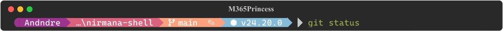 | `nirmana theme M365Princess` |
| **marcduiker** |  | `nirmana theme marcduiker` |
| **markbull** |  | `nirmana theme markbull` |
| **material** | 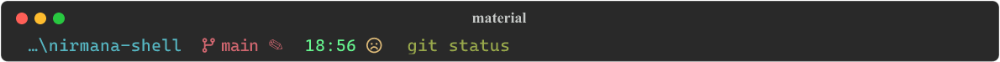 | `nirmana theme material` |
| **microverse-power** |  | `nirmana theme microverse-power` |
| **mojada** |  | `nirmana theme mojada` |
| **montys** |  | `nirmana theme montys` |
| **mt** |  | `nirmana theme mt` |
| **multiverse-neon** |  | `nirmana theme multiverse-neon` |
| **negligible** |  | `nirmana theme negligible` |
| **neko** | 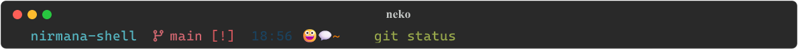 | `nirmana theme neko` |
| **night-owl** | 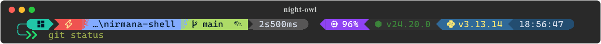 | `nirmana theme night-owl` |
| **nordtron** | 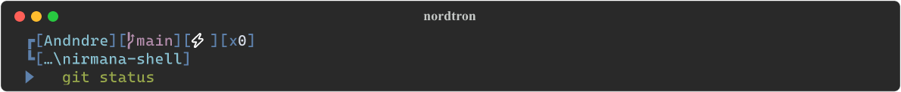 | `nirmana theme nordtron` |
| **nu4a** |  | `nirmana theme nu4a` |
| **onehalf.minimal** |  | `nirmana theme onehalf.minimal` |
| **pararussel** | 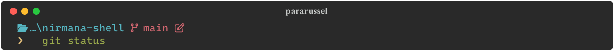 | `nirmana theme pararussel` |
| **patriksvensson** | 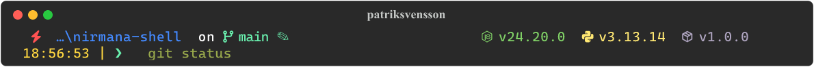 | `nirmana theme patriksvensson` |
| **peru** |  | `nirmana theme peru` |
| **pixelrobots** |  | `nirmana theme pixelrobots` |
| **plague** |  | `nirmana theme plague` |
| **poshmon** |  | `nirmana theme poshmon` |
| **powerlevel10k_classic** | 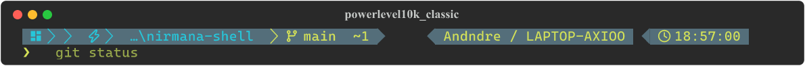 | `nirmana theme powerlevel10k_classic` |
| **powerlevel10k_lean** | 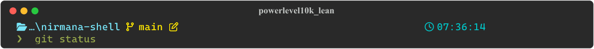 | `nirmana theme powerlevel10k_lean` |
| **powerlevel10k_modern** |  | `nirmana theme powerlevel10k_modern` |
| **powerline** |  | `nirmana theme powerline` |
| **probua.minimal** |  | `nirmana theme probua.minimal` |
| **pure** | 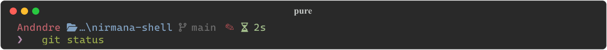 | `nirmana theme pure` |
| **quick-term** |  | `nirmana theme quick-term` |
| **remk** |  | `nirmana theme remk` |
| **rudolfs-dark** |  | `nirmana theme rudolfs-dark` |
| **rudolfs-light** |  | `nirmana theme rudolfs-light` |
| **sim-web** | 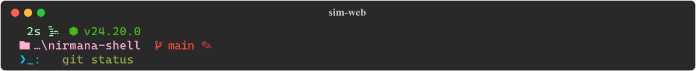 | `nirmana theme sim-web` |
| **slim** |  | `nirmana theme slim` |
| **slimfat** |  | `nirmana theme slimfat` |
| **smoothie** | 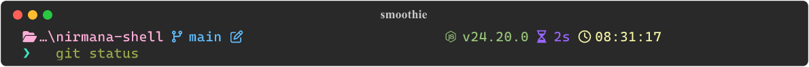 | `nirmana theme smoothie` |
| **sonicboom_dark** | 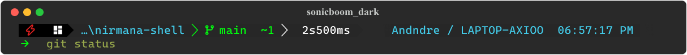 | `nirmana theme sonicboom_dark` |
| **sonicboom_light** | 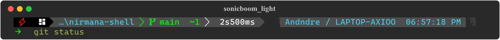 | `nirmana theme sonicboom_light` |
| **sorin** |  | `nirmana theme sorin` |
| **space** |  | `nirmana theme space` |
| **star** | 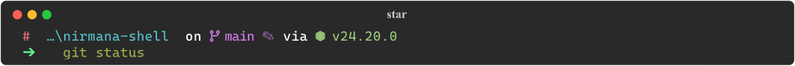 | `nirmana theme star` |
| **stelbent-compact.minimal** |  | `nirmana theme stelbent-compact.minimal` |
| **stelbent.minimal** |  | `nirmana theme stelbent.minimal` |
| **the-unnamed** |  | `nirmana theme the-unnamed` |
| **thecyberden** |  | `nirmana theme thecyberden` |
| **tiwahu** |  | `nirmana theme tiwahu` |
| **tokyo** |  | `nirmana theme tokyo` |
| **tonybaloney** |  | `nirmana theme tonybaloney` |
| **uew** |  | `nirmana theme uew` |
| **unicorn** |  | `nirmana theme unicorn` |
| **velvet** |  | `nirmana theme velvet` |
| **wholespace** |  | `nirmana theme wholespace` |
| **wopian** |  | `nirmana theme wopian` |
| **xtoys** |  | `nirmana theme xtoys` |
| **ys** |  | `nirmana theme ys` |
| **zash** |  | `nirmana theme zash` |

</details>

<details open>
<summary><b>Official Starship Presets (10 Presets)</b></summary>

| Preset                   | Preview                                                           | Command                              |
| :----------------------- | :---------------------------------------------------------------- | :----------------------------------- |
| **catppuccin-powerline** |  | `nirmana theme catppuccin-powerline` |
| **gruvbox-rainbow**      |            | `nirmana theme gruvbox-rainbow`      |
| **pastel-powerline**     |          | `nirmana theme pastel-powerline`     |
| **bracketed-segments**   |      | `nirmana theme bracketed-segments`   |
| **nerd-font-symbols**    |        | `nirmana theme nerd-font-symbols`    |
| **no-empty-icons**       |              | `nirmana theme no-empty-icons`       |
| **no-nerd-font**         |                  | `nirmana theme no-nerd-font`         |
| **no-runtime-versions**  |    | `nirmana theme no-runtime-versions`  |
| **plain-text-symbols**   |      | `nirmana theme plain-text-symbols`   |
| **pure-preset**          |                    | `nirmana theme pure-preset`          |

</details>

Usage example:

```powershell
nirmana theme
nirmana theme takuya
nirmana theme bubbles
nirmana theme robbyrussell
nirmana theme spaceship
nirmana theme catppuccin-mocha
```

---

## Oh My Posh Theme Transpiler (`nirmana import-theme`)

Nirmana-Shell includes a built-in transpiler engine ([convert-omp.py](scripts/convert-omp.py)) that translates Oh My Posh JSON themes (`*.omp.json`) into native, high-performance Starship configurations (`*.toml`).

### Key Capabilities

- **Zero Runtime Overhead:** Enjoy community theme aesthetics on Starship's compiled Rust engine (<10ms latency), eliminating the 50ms - 150ms shell startup latency of Go-based prompt engines on Windows.
- **Layout Normalization:** Adapts arbitrary block sequences into Nirmana's standard multi-line architecture with dynamic `$fill` right-alignment for execution duration and hardware metrics.
- **Color & Powerline Preservation:** Accurately maps hex palettes, palette lookups (`p:color`), diamond capsules (``/``), and powerline chevrons (``/``).
- **Automated Visual Previews:** Automatically generates both ANSI TUI preview cards (`.previews/`) and high-resolution rasterized PNG cards (`assets/previews/`) upon import.

### How to Import

Import any Oh My Posh theme using the `nirmana import-theme` command:

```powershell
# 1. Import by shorthand name directly from the official Oh My Posh repository
nirmana import-theme quick-term

# 2. Import from a custom remote URL (e.g. GitHub raw) with an optional custom name
nirmana import-theme https://raw.githubusercontent.com/.../custom.omp.json my-theme

# 3. Import from a local file
nirmana import-theme .\my-theme.omp.json
```

Alternatively, run the transpiler script directly via `uv`:

```powershell
uv run python scripts/convert-omp.py quick-term --output themes/quick-term.toml
```

Regenerate the maintained Oh My Posh collection directly from the upstream repository. This rewrites only the themes listed in [`scripts/omp-themes.txt`](scripts/omp-themes.txt); curated Nirmana themes remain unchanged.

```powershell
uv run --with rich --with resvg-py python scripts/convert-omp.py --upstream --output themes
```

---

## Why Starship?

Nirmana-Shell selects [Starship](https://starship.rs) as its core prompt engine for distinct architectural advantages:

- **High Performance (Rust-Native):** Starship is compiled to native machine code with zero runtime overhead. Prompt latency consistently remains under 10ms, eliminating terminal input stutter even in large repositories and complex directories.
- **Universal Portability:** A single `starship.toml` configuration file works identically across PowerShell 7, Bash, Zsh, Fish, and NuShell on Windows, Linux, and macOS.
- **Declarative Configuration:** Uses clean TOML syntax instead of complex shell script evaluation or deeply nested JSON/YAML structures.
- **Intelligent Module Caching:** Modules for Git status, language runtimes, and command durations execute asynchronously and cache results, preventing terminal freezes during network or slow disk operations.

---

## Comparison with Alternatives

How Nirmana-Shell compares against other popular Windows terminal configurations and prompt tools:

| Feature / Aspect              | Nirmana-Shell                                    | Chris Titus Tech (`win-dotfiles`) | Oh My Posh (`oh-my-posh`)  | Standalone Dotfiles        |
| :---------------------------- | :----------------------------------------------- | :-------------------------------- | :------------------------- | :------------------------- |
| **Prompt Engine**             | Starship (Rust)                                  | Starship (Rust)                   | Oh My Posh (Go)            | Varies (Starship / Custom) |
| **Primary Scope**             | Full Terminal Environment & Theme Suite          | Windows Tweaks & General Dotfiles | Prompt Engine Only         | Personal Configs           |
| **Installation**              | 1-Line Remote (`irm ... \| iex`)                 | PowerShell / Batch Script         | Package Manager (`winget`) | Manual Git Clone & Copy    |
| **Curated Themes**            | 18 Curated + 108 OMP + 10 Presets                | 1 Default Theme                   | 100+ Community Themes      | 1 Custom Theme             |
| **Interactive TUI Switcher**  | Built-in (`nirmana theme` via FZF)               | None (Static Config)              | CLI / Manual Config        | None                       |
| **Terminal Scheme Sync**      | Automatic (Windows Terminal JSON)                | Partial                           | Manual                     | Manual                     |
| **CLI Toolchain Integration** | Complete (`eza`, `fzf`, `zoxide`, `delta`, `fd`) | Focused (`zoxide`, `fzf`)         | None (Prompt only)         | Varies                     |
| **Version & Diagnostics**     | Built-in (`nirmana version` & `doctor`)          | Basic Script Checks               | `oh-my-posh version`       | None                       |

### Key Distinctions

- **Versus Chris Titus Tech (`win-dotfiles`):** While `win-dotfiles` offers a proven system-wide setup tailored to general Windows utilities with a single static Starship theme, Nirmana-Shell focuses exclusively on the terminal developer experience: providing an interactive 27-theme TUI switcher, right-aligned `$fill` layouts, automated visual galleries, and full Delta git pager integration.
- **Versus Oh My Posh:** Oh My Posh is an outstanding prompt engine with a vast collection of community themes. However, Oh My Posh is solely a prompt engine. Nirmana-Shell integrates Starship into a cohesive terminal ecosystem that configures PSReadLine, predictive completions, syntax-highlighted git diffs, directory jumping, and automatic Windows Terminal color scheme synchronization.
- **Versus Standalone Dotfiles / Community Presets:** Standalone dotfiles require manual package installations, manual font configuration, and editing TOML files by hand. Nirmana-Shell packages everything into an automated, idempotent setup with self-healing profile reloaders and versioned health checks.

---

## Repository Layout

```text
nirmana-shell/
├── LICENSE                 # MIT license and acknowledgements
├── README.md               # Documentation
├── VERSION                 # Single source of truth for version number
├── CHANGELOG.md            # Standard Keep a Changelog documentation
├── setup.ps1               # Automated installer
├── switch-theme.ps1        # Theme switcher with real-time preview
├── preview.cmd             # Fast preview helper for FZF TUI
├── .previews/              # Pre-rendered theme preview cards (ANSI text)
├── assets/
│   └── previews/           # Pre-rendered PNG cards for documentation
├── configs/
│   └── Microsoft.PowerShell_profile.ps1 # PowerShell 7 profile
├── scripts/
│   └── generate-previews.py # Tool to render previews to PNG
└── themes/                 # 17 custom and adapted Starship themes (*.toml)
```

---

## License

MIT License. See [LICENSE](file:///D:/nirmana-shell/LICENSE) for details.

Includes integrations with:

- Starship (ISC License): https://starship.rs
- Zoxide (MIT License): https://github.com/ajeetdsouza/zoxide
- Eza (EUPL-1.2 License): https://github.com/eza-community/eza
- FZF (MIT License): https://github.com/junegunn/fzf
- Delta (MIT License): https://github.com/dandavison/delta
- FD (MIT/Apache-2.0 License): https://github.com/sharkdp/fd
- PSReadLine (MIT License): https://github.com/PowerShell/PSReadLine
